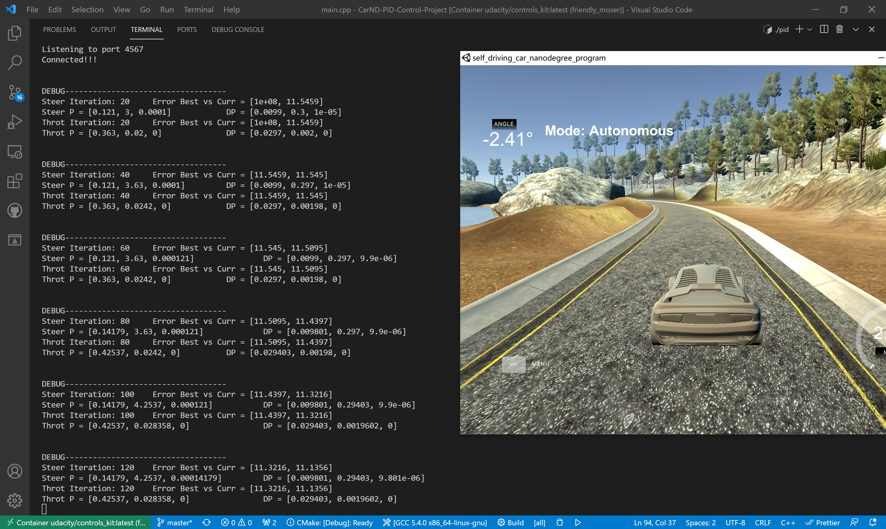

# CarND-Controls-PID
Self-Driving Car Engineer Nanodegree Program

---

## Introduction

This project aims to use PID to make the car safely drive as soon as possible on the simulator. We should try to tune the pid parameters in any ways. The simulator provides the cross-track error(CTE), speed, steer angle data. Here I use two PID controllers, one for speed and the other for throttle. The throttle PID controls aims to make to car drive as soon as possible.

The following videos shows the results https://www.youtube.com/watch?v=_AaCi5agN5k .

---

## Rubric Points

1. The PID procedure follows what was taught in the lessons.
  The code here is based on the letures. The tuning part is absolutely the twiddle function provided on the lecture notes.

2. Describe the effect each of the P, I, D components had in your implementation.

The P (proportional) controller has the most directly effect on the cars motion state. It is the  specific proportional value of the cross track error(the distance from the lane center). If the car deviated from the lane center a lot, then the P value is big, and vice vesa. In my code P gain is `-K_p * CTE`.

The D (differential) controller reflects the change rate of the error, and trying to bring this rate to zero. It aims at smoothing the error trajectory and guide the car back to the lane center. In my code D gain is `-K_d * (CTE - P_error)`.

The I (integral) controller considers the total history error of all the time and then muliply to a constant number. It mainly focus on the time accumulation of the error. Such as the car in a high speed, the I gain will accumulate a large error signal very quickly. So it will help to reduce P gain which causes oscillations at high speeds. In my code I gain is `-K_i * accumulate(CTE)`.

3. Describe how the final hyperparameters were chosen.

As the project combines with server and the simulator interactions lacking of the debug tools support, so first I tuning the parameters manually. The Goal of the manually tuning is to keep the car drive inside the lane and can finish driving safely as least on 1 lap. Then I get the result parameters as following:
* PID for Steering: [0.1, 0.0001, 3.0]
* PID for throttle: [0.3, 0,      0.02]

Then I use the Twiddle method to autotune the PID controllers. As the car's speed get faster, it will cause oscillation and drifting out from the lane quickly. So I set the iterations as 20 for the tunning parameters tuning take effects to smooth the error trajectory. Less iterations, less time, less accumulated errors, and the car can counteract the error as soon as possible.

The final tunning parameters is as follows:
* PID for Steering: [0.121, 0.0001, 3   ]
* PID for throttle: [0.363, 0,      0.02]

